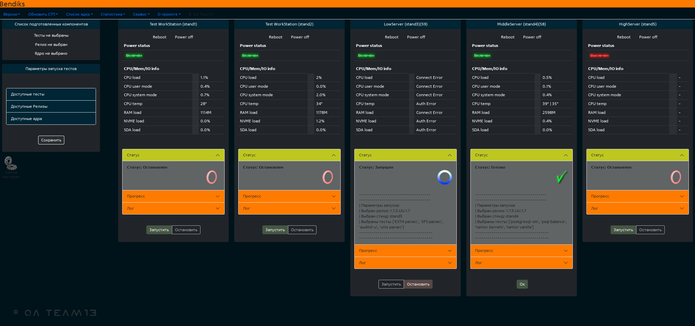

# Astra Linux Load Tests Automation        
Проект является веб-приложением выполняющим функции оркестратора, интегрированного в среду нагрузочного тестирования **DEVQA**.  
Доступен по адресу: [http://allta.devos.astralinux.ru](http://allta.devos.astralinux.ru)

### Основные возможности
-  Позволяет администрировать группу из 5 серверов (вариативно).
-  Создавать тестовые прогоны. 
-  Создавать страницы с отчетом о составе тестового прогона и ходе его выполнения.
-  Запускать различные тестовые сценарии.
-  Отслеживать определенные метрики нагрузки тестовых серверов.
-  Отслеживать ход выполнения тестовых прогонов.

#### По результатам проведенных испытаний предоставляет статистику.
-  [Статистика](https://life.astralinux.ru/pages/viewpage.action?pageId=140674766&src=contextnavpagetreemode)

### Визуальное представление

### Настройки
Перед началом выполнения нового тестового прогона, нужно добавить RC с помощью ALLTAbot.  
-  В качестве примера будем рассматривать RC 1.7.5.4
-  /addrc_acs <1.7.5.4> <'password'>
-  Дождаться выполнения   

