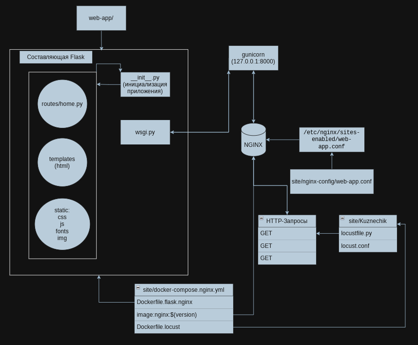
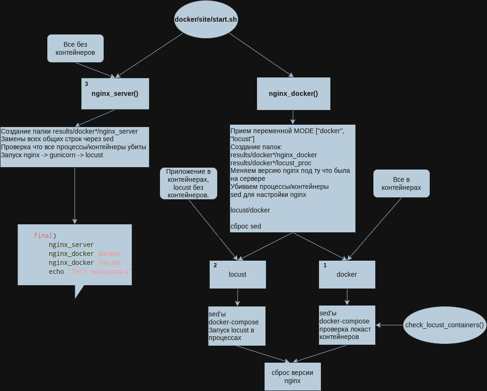
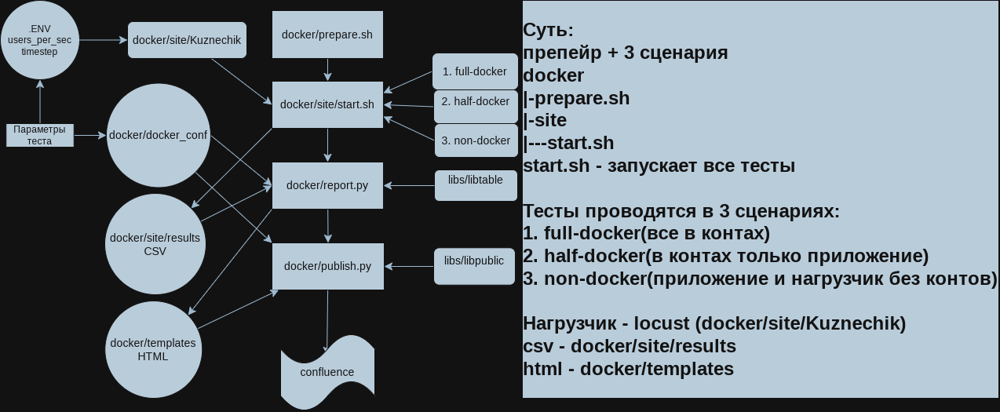
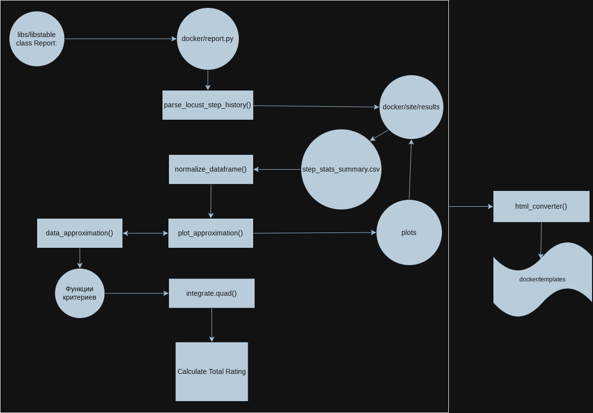

# Docker
Система нагрузочного тестирования Docker

### Test 1

**Описание**:

Cравнительный анализ производительности веб-сервера при различных сценариях развертывания (полностью в контейнерах, гибридный вариант и нативное исполнение) для оценки влияния среды выполнения на пропускную способность, задержки и стабильность работы под нагрузкой.

Создается нагрузка на web-приложение в docker контейнерах.
Тест содержит в себе 3 составляющии. 
 - Нагрузка из контейнеров на приложение в контейнере(**full-docker**)
 - Нагрузка из процессов на приложение в контейнере(**half-docker**)
 - Нагрузка из процессов на приложение без контейнеров(**non-docker**)

**Web-приложение** - site/web_app/ - (flask - wsgi - gunicorn - nginx)

Детализированная схема работы Веб-приложения с нагрузчиком locust



**Генерация тестов** - site/start.sh

Детализированная схема работы start.sh



**Prepare** - prepare.sh

**Запуск** - run.py с параметром -t web

Фреймворк для нагрузки - locust

Используется метод **ступенчатой нагрузки** с интервальным повышением кол-ва пользователей на N значение каждые T секунд.

Детализированная схема работы всего теста



Для изменения кол-ва пользователей и времени на шаг в site/.env изменить параметры:

```
USERS_PER_SEC=1800
TIMESTEP=15
```


При расчете итогового рейтинга участвуют такие критерии как:

- Кол-во обработанных запросов - (**Requests/s**)
- Ср. арифм. времени отклика - (**Average Response Time**)
- Кол-во запросов с ошибкой - (**Failures/s**) 

Весовые коэфициенты обозначены как равнозначные, поэтому имеют вес 0.33

*В силу того что ошибок может не возникнуть, было принято решение учитывать критерий ошибок как второстепенный, при наличии которого рейтинг будет уменьшен на 0.1/0.33 в силу критичности ошибок.*

После выполнения теста и конвертации результатов, итоговые результаты фиксируются в пути site/results/*/ 

Также результаты конвертации csv в html таблицы находятся по пути templates/*/

Детализированная схема построения total rating и получения результатов



**Зависимости**

- Flask
- gunicorn
- atlassian-python-api
- locust
- requests
- numpy
- pandas
- scipy
- scikit-learn
- matplotlib
