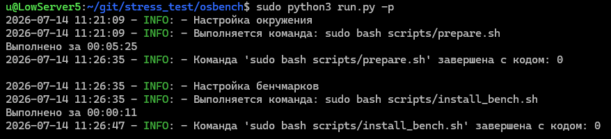
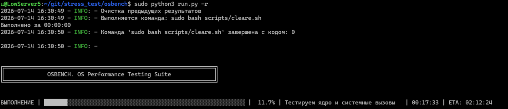
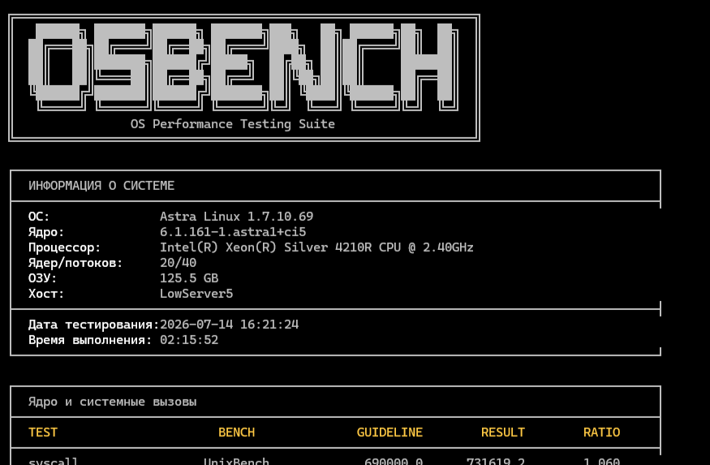

```
╔═══════════════════════════════════════════════════════════════╗    
║   ██████╗ ███████╗██████╗ ███████╗███╗   ██╗ ██████╗██╗  ██╗  ║   
║  ██╔═══██╗██╔════╝██╔══██╗██╔════╝████╗  ██║██╔════╝██║  ██║  ║   
║  ██║   ██║███████╗██████╔╝█████╗  ██╔██╗ ██║██║     ███████║  ║   
║  ██║   ██║╚════██║██╔══██╗██╔══╝  ██║╚██╗██║██║     ██╔══██║  ║   
║  ╚██████╔╝███████║██████╔╝███████╗██║ ╚████║╚██████╗██║  ██║  ║   
║   ╚═════╝ ╚══════╝╚═════╝ ╚══════╝╚═╝  ╚═══╝ ╚═════╝╚═╝  ╚═╝  ║    
║                OS Performance Testing Suite                   ║    
╚═══════════════════════════════════════════════════════════════╝    
```


# OSBench — Комплексный бенчмарк производительности операционных систем

## Назначение

**OSBench** — это специализированный инструмент для оценки производительности операционных систем с фокусом на **системные вызовы, планировщик, файловую систему и межпроцессное взаимодействие**. В отличие от других бенчмарков, OSBench нацелен на измерение ключевых характеристик ОС, а не аппаратного обеспечения.

---

## Математическая модель

### Принцип расчёта индекса

Общий индекс OSBench рассчитывается на основе **взвешенного среднего геометрического** показателей всех подсистем. Это обеспечивает сбалансированную оценку, где:

1. **Слабые места** имеют большее влияние на итоговый результат
2. **Выбросы** не искажают общую картину
3. **Каждая подсистема** вносит пропорциональный вклад


### Веса подсистем

| Подсистема | Вес | Обоснование |
|------------|-----|-------------|
| **Ядро и системные вызовы** | 40% | Основа ОС, критична для всех операций |
| **Процессы и IPC** | 25% | Важна для многозадачности и взаимодействия процессов |
| **Файловая система** | 30% | Ключевой компонент для операций ввода-вывода |
| **Реалистичная нагрузка** | 5% | Оценка производительности в реальных сценариях |

Внутри каждой подсистемы веса тестов распределены так, что их сумма равна 100%.

### Расчёт индекса подсистемы

Индекс каждой подсистемы вычисляется как **взвешенное среднее геометрическое** соотношений `RESULT / GUIDELINE` для всех входящих в неё тестов.   
`GUIDELINE` — эталонное значение, полученное на референсной системе.

### Референсная система

#### ОС
 `ALSE 1.8.5.39` в режиме `Орел`  

#### Параметры стенда

**CPU:** 2x Intel(R) Xeon(R) Silver 4210 CPU @ 2.2GHz   
**Cores:** 10; **Threads:** 20; **Total:** 20/40   
**RAM:** 128GB   
**STORAGE:** SAS NVME 3.2TB | Samsung MZPLJ3T2HBJR-000H3 | r/w speed до 6600MBs/4900MBs   

---

## Описание тестов

### 1. Ядро и системные вызовы

#### Системные вызовы

| Тест | Бенчмарк | Описание |
|------|----------|----------|
| **syscall** | UnixBench | Измеряет производительность базовых системных вызовов (getpid, getuid и др.). Показывает общую эффективность ядра. |
| **lat_syscall null** | LMbench | Замеряет задержку пустого системного вызова (getppid). Минимальная стоимость перехода в ядро. |
| **lat_syscall read** | LMbench | Замеряет задержку системного вызова read() на /dev/zero. Оценка затрат на чтение данных через ядро. |
| **lat_syscall write** | LMbench | Замеряет задержку системного вызова write() на /dev/null. Оценка затрат на запись данных через ядро. |

#### Планировщик

| Тест | Бенчмарк | Описание |
|------|----------|----------|
| **sched pipe** | Perf Bench | Измеряет производительность pipe через планировщик. Оценка эффективности переключения контекста. |
| **sched messaging** | Perf Bench | Измеряет производительность межпроцессного взаимодействия через планировщик. Оценка IPC и планирования. |

#### Синхронизация

| Тест | Бенчмарк | Описание |
|------|----------|----------|
| **futex hash** | Perf Bench | Измеряет производительность хеш-таблицы с futex. Оценка эффективности быстрых мьютексов в ядре. |
| **futex wake** | Perf Bench | Замеряет время пробуждения потоков через futex. Оценка эффективности работы с блокировками. |
| **futex requeue** | Perf Bench | Замеряет время перемещения очереди futex. Оценка эффективности управления очередями ожидания. |

#### События

| Тест | Бенчмарк | Описание |
|------|----------|----------|
| **epoll wait** | Perf Bench | Измеряет производительность ожидания событий через epoll. Критично для высоконагруженных серверов. |
| **epoll ctl** | Perf Bench | Измеряет производительность управления событиями через epoll. Оценка накладных расходов на регистрацию событий. |

#### Сигналы

| Тест | Бенчмарк | Описание |
|------|----------|----------|
| **lat_sig install** | LMbench | Замеряет время установки обработчика сигнала. |
| **lat_sig catch** | LMbench | Замеряет время перехвата и обработки сигнала. |

---

### 2. Процессы и межпроцессное взаимодействие (IPC)

#### Создание процессов

| Тест | Бенчмарк | Описание |
|------|----------|----------|
| **spawn** | UnixBench | Измеряет скорость создания новых процессов. Оценка эффективности fork/exec. |
| **execl** | UnixBench | Измеряет скорость запуска новых программ. Оценка стоимости execve(). |
| **lat_proc fork** | LMbench | Замеряет время системного вызова fork(). |
| **lat_proc exec** | LMbench | Замеряет время системного вызова execve(). |

#### IPC механизмы

| Тест | Бенчмарк | Описание |
|------|----------|----------|
| **pipe** | UnixBench | Измеряет пропускную способность pipe. Оценка эффективности каналов. |
| **context1** | UnixBench | Измеряет производительность переключения контекста через pipe. |
| **lat_pipe** | LMbench | Замеряет задержку передачи данных через pipe. |
| **bw_pipe** | LMbench | Измеряет пропускную способность pipe в MB/s. |

---

### 3. Файловая система

#### Пропускная способность

| Тест | Бенчмарк | Описание |
|------|----------|----------|
| **bw_file_rd** | LMbench | Измеряет пропускную способность чтения файлов. Оценка эффективности работы ФС. |

#### Операции копирования

| Тест | Бенчмарк | Описание |
|------|----------|----------|
| **fstime** | UnixBench | Измеряет скорость копирования файлов блоками 1024 байта. |
| **fsbuffer** | UnixBench | Измеряет скорость копирования файлов блоками 256 байт. |
| **fsdisk** | UnixBench | Измеряет скорость копирования файлов блоками 4096 байт. |

#### Латентность ФС

| Тест | Бенчмарк | Описание |
|------|----------|----------|
| **lat_fs 0K** | LMbench | Замеряет латентность файловой системы для файлов нулевого размера. |
| **lat_fs 10K** | LMbench | Замеряет латентность файловой системы для файлов размером 10 КБ. |

#### fs_mark нагрузка

| Тест | Бенчмарк | Описание |
|------|----------|----------|
| **speed** | fs_mark | Общая скорость операций с файлами (ops/sec). |
| **app_overhead** | fs_mark | Накладные расходы приложения при работе с файлами. |
| **create_avg** | fs_mark | Среднее время создания файлов. |
| **write_avg** | fs_mark | Среднее время записи в файлы. |
| **fsync_avg** | fs_mark | Среднее время синхронизации файлов между ОЗУ и диском (fsync). |
| **close_avg** | fs_mark | Среднее время закрытия файлов. |
| **unlink_avg** | fs_mark | Среднее время удаления файлов. |

---

### 4. Реалистичная нагрузка

| Тест | Бенчмарк | Описание |
|------|----------|----------|
| **shell1** | UnixBench | Измеряет производительность выполнения shell-скриптов в одном потоке. |
| **shell8** | UnixBench | Измеряет производительность выполнения shell-скриптов в 8 параллельных потоках. |

---

## Интерпретация результатов

### Шкала индексов

| Индекс | Оценка |
|--------|--------|
| **> 110** | Хорошая производительность |
| **103 – 110** | Выше эталона |
| **97 – 103** | Норма (в пределах погрешности) |
| **90 – 97** | Ниже эталона |
| **< 90** | Неудовлетворительная производительность |

### Расшифровка RATIO

- **RATIO > 1.0** — система показывает лучшие результаты, чем эталонная
- **RATIO = 1.0** — производительность соответствует эталону
- **RATIO < 1.0** — система уступает эталонной

---

## Особенности OSBench

### Преимущества

1. **Фокус на ОС** — измеряет характеристики системы, а не железа
2. **Многопараметрическая оценка** — охватывает все ключевые подсистемы
3. **Взвешенная модель** — учитывает важность каждой подсистемы
4. **Воспроизводимость** — тесты выполняются с одинаковыми настройками
5. **Сравнимость** — результаты можно сравнивать между разными системами

### Принципы тестирования

- Исключены тесты, зависящие от драйверов/графики
- Исключены тесты, зависящие от памяти/кэша процессора
- Бенчмарки, проверенные временем (UnixBench, LMbench, Perf, fs_mark)
- Минимальная избыточность — каждая подсистема покрыта без дублирования

---

## Используемые бенчмарки

| Бенчмарк | Назначение | Используемые тесты |
|----------|------------|-------------------|
| **UnixBench** | Общая производительность ОС | `syscall`, `execl`, `spawn`, `pipe`, `context1`, `shell1`, `shell8`, `fstime`, `fsbuffer`, `fsdisk` |
| **LMbench** | Задержки и пропускная способность | `lat_syscall null`, `lat_syscall read`, `lat_syscall write`, `lat_ctx`, `lat_sig install`, `lat_sig catch`, `lat_pipe`, `bw_pipe`, `lat_proc fork`, `lat_proc exec`, `lat_fs 0K`, `lat_fs 10K`, `bw_file_rd` |
| **Perf Bench** | Подсистемы ядра | `sched pipe`, `sched messaging`, `futex hash`, `futex wake`, `futex requeue`, `epoll wait`, `epoll ctl` |
| **fs_mark** | Производительность ФС | `speed`, `app_overhead`, `create_avg`, `write_avg`, `fsync_avg`, `close_avg`, `unlink_avg` |


## Сводка по тестам

| Бенчмарк | Количество тестов |
|----------|-------------------|
| UnixBench | 10 |
| LMbench | 13 |
| Perf Bench | 7 |
| fs_mark | 7 |
| **ИТОГО** | **37** |

---


## Внешние ресурсы
- http://downloads.sourceforge.net/fsmark/fs_mark.tgz
- https://github.com/kdlucas/byte-unixbench.git
- https://github.com/intel/lmbench.git

---


## Запуск

### Подготовка окружения
Выполняется запуском команды из директории проекта `git`
```bash
sudo python3 run.py -p
``` 
   
   
### Запуск теста
```bash
sudo python3 run.py -r
```
   
   
### Пример таблицы с результатами
   

   
## Важные предупреждения

---

### 1. Риск потери данных при тестировании файловой системы
**Описание:** При тестировании производительности файловой системы создаётся новый раздел на указанном диске, с дальнейшим форматированием и монтированием.    
Все данные на этом диске будут безвозвратно утеряны.   
**Рекомендация:** Использовать отдельный диск без важных данных, указать его в конфигурационном файле `conf.py`.    

---    

### 2. Высокая нагрузка на систему
**Описание:** Бенчмарк активно использует все доступные ядра процессора, оперативную память и дисковую подсистему.    
В процессе тестирования система может стать неотзывчивой для других задач.   
**Рекомендация:** Запускать тесты на изолированных системах.    

---

### 3. Требуются права суперпользователя
**Описание:** Некоторые тесты требуют привилегий суперпользователя для доступа к дискам и системным ресурсам.    
**Рекомендация:** Запускать скрипт с sudo или от пользователя с соответствующими правами.    

---

### 4. Предупреждения компилятора (при сборке)
**Описание:** В процессе сборки UnixBench, LMbench, fs_mark и Perf Bench могут возникать предупреждения о потенциально устаревших конструкциях.    
Они безопасны и не влияют на результаты тестирования.    

---

### 5. Вывод результатов в stderr
**Описание:** Некоторые бенчмарки по умолчанию направляют свои результаты в stderr, что может быть воспринято как ошибка.    
Это нормальное поведение, и все сообщения stderr являются частью результатов теста.   
    

